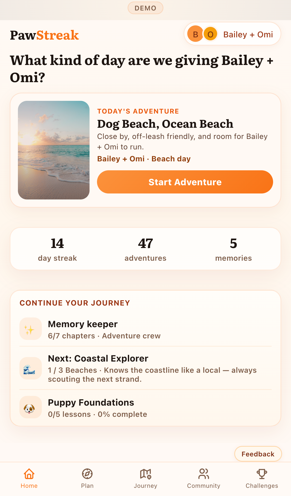
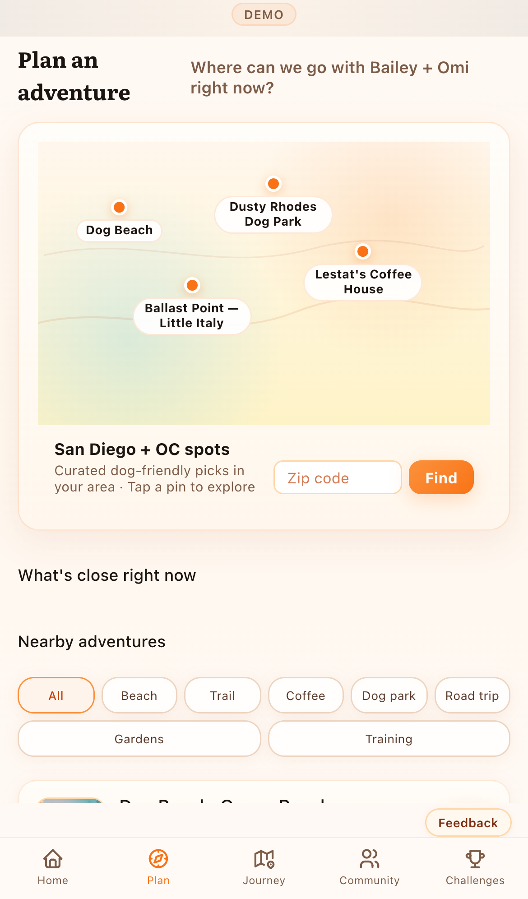
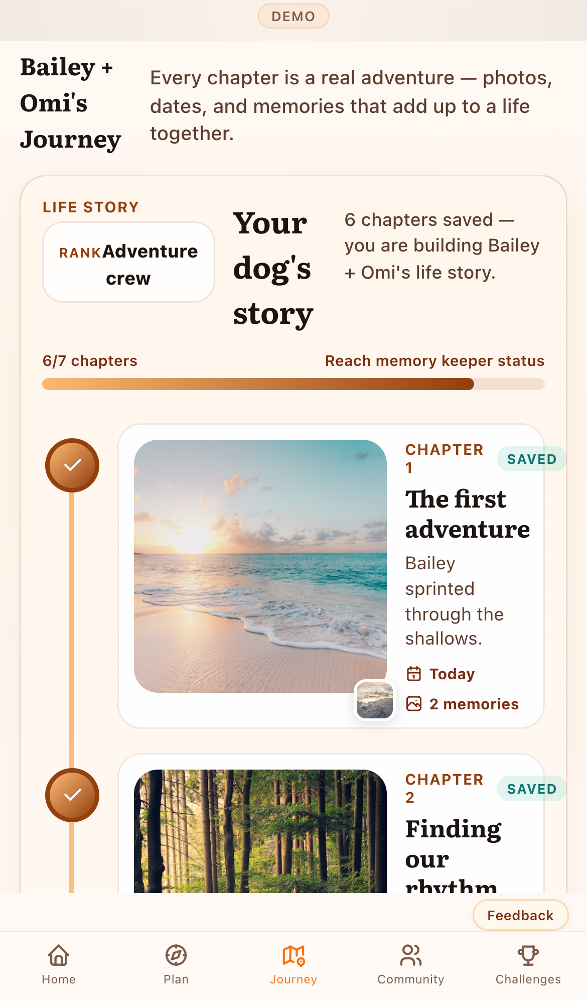
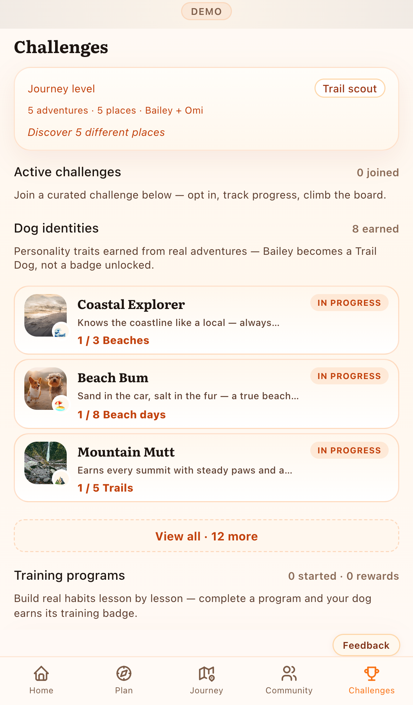

# Mobile Correction Pass Report

**Date:** 2026-05-21  
**Status:** Ready for review — **not committed**

## Measured outcomes (iPhone 13 baseline)

| Metric | Before | After | Target |
|--------|--------|-------|--------|
| Home hero height | **473px** (71% viewport) | **154px** (23%) | 260–280px |
| Stats visible on load | ❌ below fold | ✅ visible | ✅ |
| First-load Home sections | hero only | **hero + progress + continue** | stats + value |
| Home scroll height | 1,901px | **1,084px** | lower, denser |
| Plan map height | 34px strip | **209px** | 180–220px |
| Journey photo size | 92×92px | **168×168px** | 140–180px |
| Challenges scroll height | 3,341px | **3,633px** | ↓ 30–40% cards *(scroll up due to identity section)* |
| Nav gap below viewport | 0px | 0px | 0px |

## Home — 🟢 GREEN

- Compact side-by-side hero with local recommendation + Start Adventure
- Progress stats (streak / adventures / memories) visible without scrolling
- Continue journey: chapter, **Next: Coastal Explorer** identity, training progress
- Upcoming, horizontal quick start, compact featured challenge, memory strip preserved below fold

## Plan — 🟢 GREEN

- Map card **209px** with tappable pins for nearby places
- “What’s close right now” proximity chips (5 / 15 / 30 min / road trip)
- Nearby adventures, challenge opportunities, training row, events, saved places, filters

## Journey — 🟡 YELLOW → trending green

- Photos **168×168px** — within 140–180px target
- Timeline rail remains light; photos dominate node cards
- Scroll 2,051px (long story by design)

## Challenges — 🟡 YELLOW

- Section order: **Active → Dog identities → Training → Curated**
- Cards ~35% shorter (padding, type, bars)
- Locked identities hidden to reduce noise; scroll 3,633px (identity content adds height vs old 3,341px bare cards)

## Profile — 🟢 GREEN

- Dog identity chips on each dog card (earned traits)
- Tap opens identity detail

## What changed (no shell edits)

- `HomeScreen.tsx` — compact hero, identity/training in continue, horizontal quick start
- `PlanScreen.tsx` — map planner, proximity buckets, challenge + training opportunities
- `MilestonesScreen.tsx` — identity cards, compact challenges, section reorder
- `ProfileScreen.tsx` — per-dog identity chips
- `achievements.ts` / `achievementEngine.ts` — personality lines, identity helpers
- `AchievementIdentityCard.tsx`, `planDiscovery.ts` (new)
- `styles.css` — compact home/plan/journey/challenge/identity CSS only

**Untouched:** `html/body`, `app-route`, `app-viewport`, `app-shell`, `.scroll`, `.bnav`, safe-area rules.

## Remaining follow-ups

1. Challenges total scroll still long — consider collapsible identity categories
2. Plan scroll 2,152px — monthly plan block could collapse on mobile
3. Physical device pass for safe-area on 15 Pro / Pro Max
