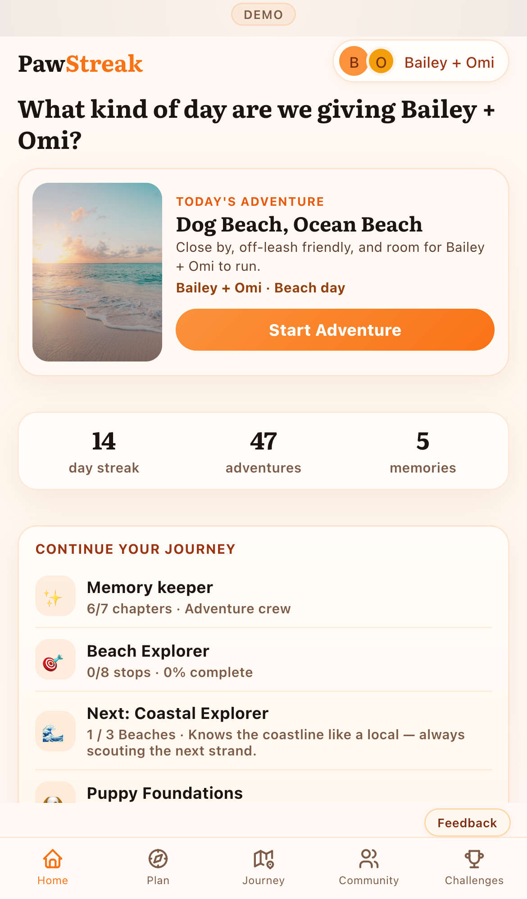
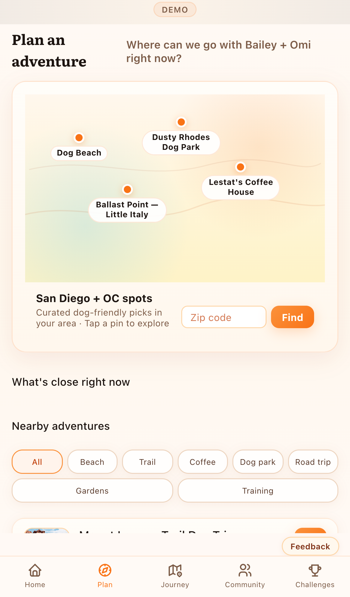
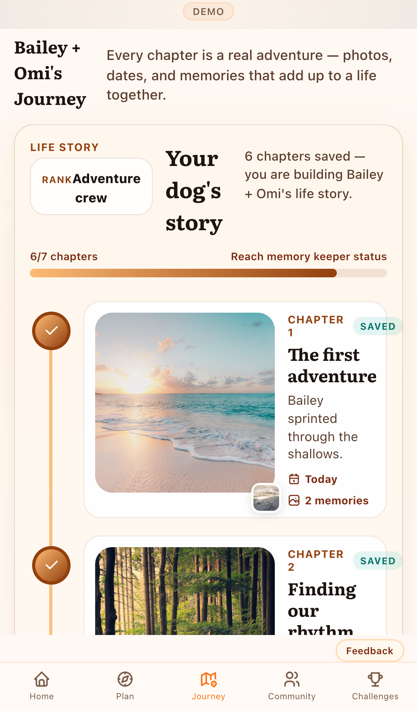
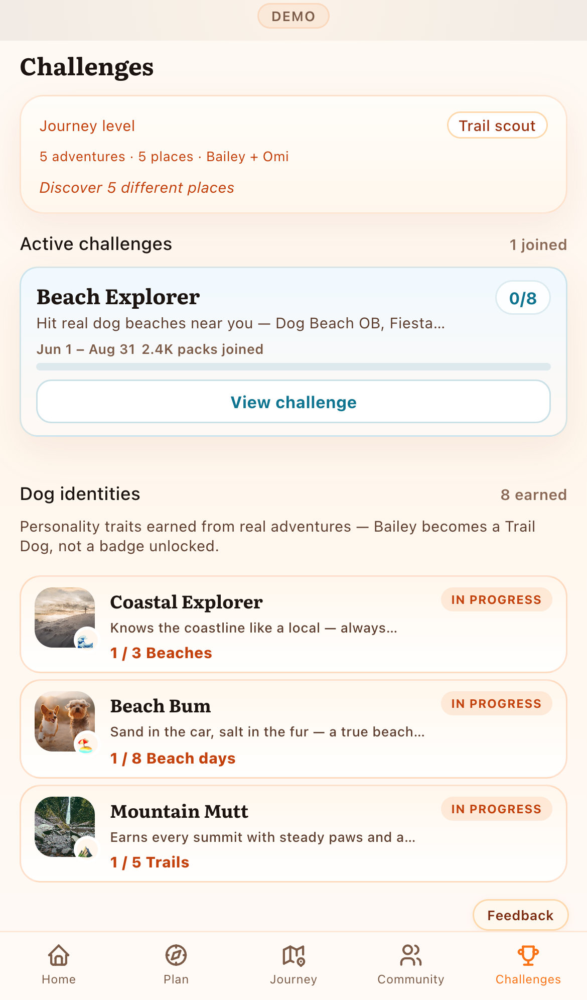

# Product Feature Restore QA Report

**Date:** 2026-05-30
**Environment:** `http://127.0.0.1:5173` (demo mode)
**Build:** verified via `npm run build`
**Status:** Ready for review — **not committed**

## Devices

- iPhone 13
- iPhone 15 Pro
- iPhone 15 Pro Max

## Shell guard

✅ All screens pass shell layout guard (nav in lower half, shell ≥75% viewport, scroll ≥120px).

## Layout metrics (all screens)

| Device | Screen | Viewport H | Scroll H | Nav top | Nav bottom | Gap below nav |
|--------|--------|------------|----------|---------|------------|---------------|
| iPhone 13 | Home | 664px | 1127px | 618px | 664px | 0px |
| iPhone 13 | Plan | 664px | 2300px | 618px | 664px | 0px |
| iPhone 13 | Journey | 664px | 2839px | 618px | 664px | 0px |
| iPhone 13 | Challenges | 664px | 1542px | 618px | 664px | 0px |
| iPhone 13 | Profile | 664px | 1084px | 618px | 664px | 0px |
| iPhone 15 Pro | Home | 659px | 1131px | 613px | 659px | 0px |
| iPhone 15 Pro | Plan | 659px | 2301px | 613px | 659px | 0px |
| iPhone 15 Pro | Journey | 659px | 2809px | 613px | 659px | 0px |
| iPhone 15 Pro | Challenges | 659px | 1542px | 613px | 659px | 0px |
| iPhone 15 Pro | Profile | 659px | 1084px | 613px | 659px | 0px |
| iPhone 15 Pro Max | Home | 739px | 1131px | 693px | 739px | 0px |
| iPhone 15 Pro Max | Plan | 739px | 2311px | 693px | 739px | 0px |
| iPhone 15 Pro Max | Journey | 739px | 2726px | 693px | 739px | 0px |
| iPhone 15 Pro Max | Challenges | 739px | 1542px | 693px | 739px | 0px |
| iPhone 15 Pro Max | Profile | 739px | 1084px | 693px | 739px | 0px |

## Feature verification

### Home

**Rating:** GREEN

| Feature | Present |
|---------|---------|
| Curated hero adventure | ✅ |
| Progress stats | ✅ |
| Active/possible adventures (continue) | ✅ |
| Training shortcut | ✅ |
| Upcoming reminders | ✅ |
| Current challenge | ✅ |
| Next dog identity | ✅ |
| Recent memories | ✅ |

- Hero height: **154px**
- Progress visible in continue: chapter, challenge, identity, training rows present

### Plan

**Rating:** GREEN

| Feature | Present |
|---------|---------|
| Real map section | ✅ |
| Nearby places | ✅ |
| Challenge opportunities | ✅ |
| Training opportunities | ✅ |
| Events | ✅ |
| Saved/favorite places | ✅ |
| Category filters | ✅ |
| Road trips/directions | ✅ |

- Map canvas height: **209px** (target 180–220px)

### Journey

**Rating:** GREEN

| Feature | Present |
|---------|---------|
| Story path | ✅ |
| Memory photos | ✅ |
| Challenge path when joined | ✅ |
| Map overlay entry | ✅ |

- Journey photo size: **168×168px** (target 140–180px)

### Challenges

**Rating:** GREEN

| Feature | Present |
|---------|---------|
| Active Challenges | ✅ |
| Dog Identities / Achievements | ✅ |
| Training Programs | ✅ |
| Curated Challenges | ✅ |
| View all / Show less | ✅ |

### Profile

**Rating:** GREEN

| Feature | Present |
|---------|---------|
| One card per dog | ✅ |
| Identity chips | ✅ |
| Edit dog | ✅ |
| Remove dog | ✅ |

- Dog cards: **2** (Bailey, Omi)
- Duplicate dogs: **no ✅**
- Clipped text nodes: **0**

## Screenshots

All screenshots saved under `qa/evidence/product-polish-fresh/`:

**iPhone 13**
- 01-home.png
- 02-plan.png
- 03-journey.png
- 04-challenges.png
- 05-profile.png

**iPhone 15 Pro**
- iphone-15-pro-home.png
- iphone-15-pro-plan.png
- iphone-15-pro-journey.png
- iphone-15-pro-challenges.png
- iphone-15-pro-profile.png

**iPhone 15 Pro Max**
- iphone-15-pro-max-home.png
- iphone-15-pro-max-plan.png
- iphone-15-pro-max-journey.png
- iphone-15-pro-max-challenges.png
- iphone-15-pro-max-profile.png
