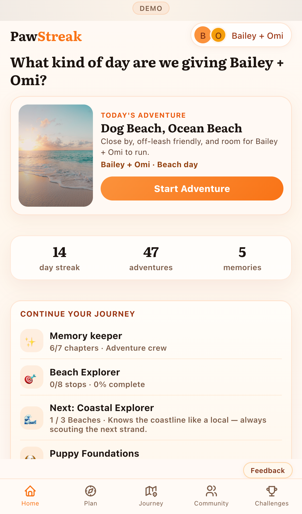
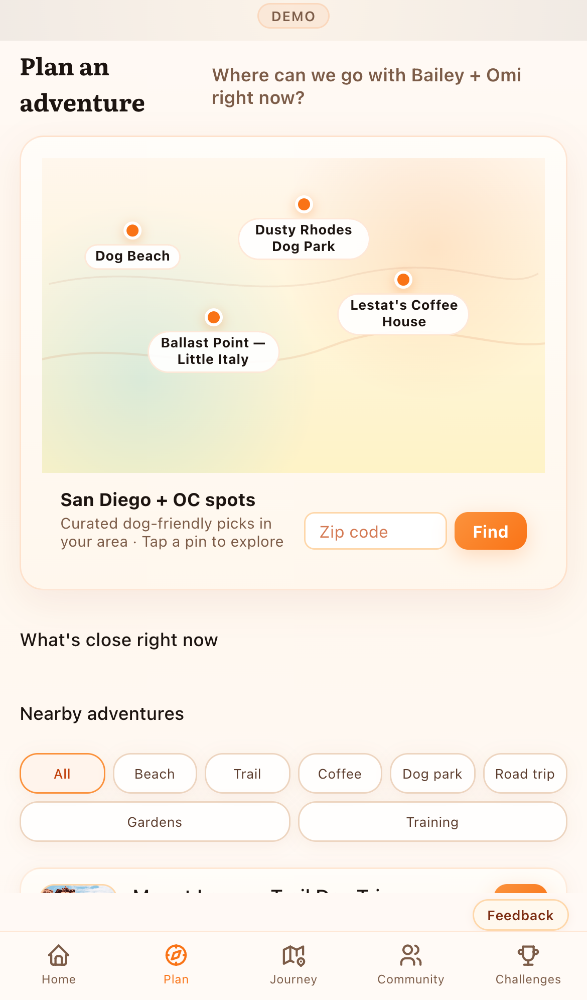
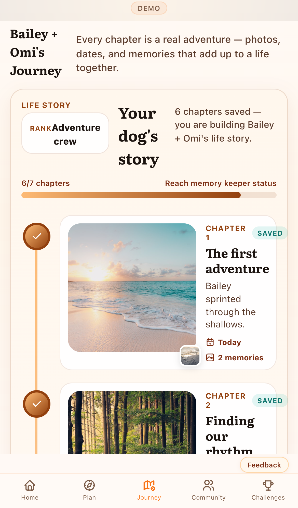
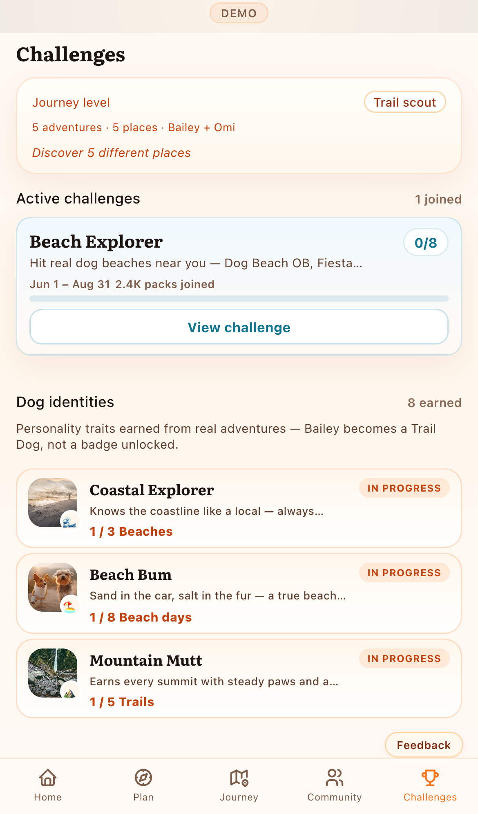
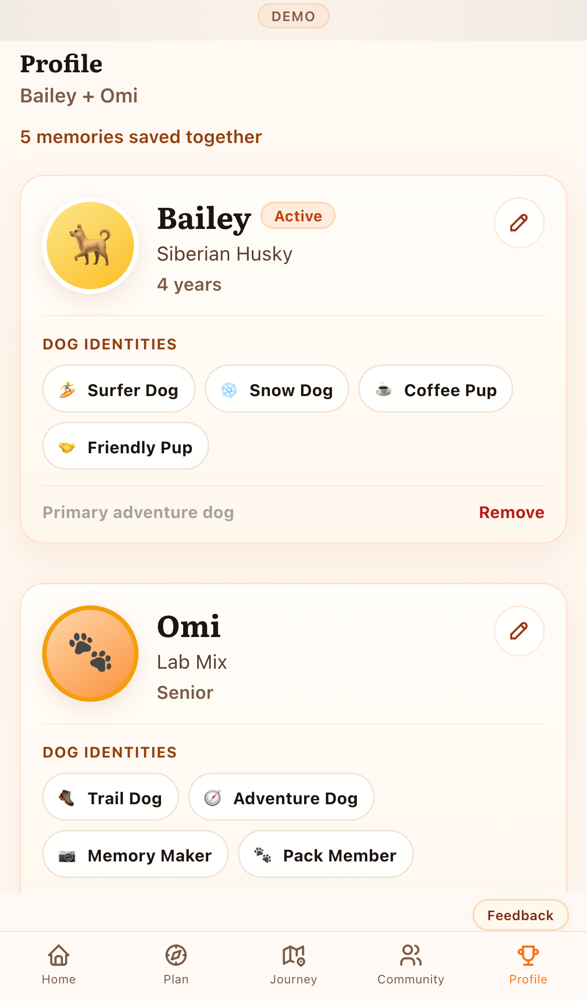

# Production Verification Report

**Date:** 2026-05-30
**Production URL:** https://pawstreakapp.com
**Commit:** `b860b7d`
**Vercel deployment:** ✅ success
[View deployment](https://vercel.com/stephen-carrolls-projects/pawstreak-launch/4CfAQF4S7Lqv16B9UzYFudBmYpPD)

## Production layout (iPhone 13)

| Screen | Viewport H | Scroll H | Nav top | Nav bottom | Gap | Rating |
|--------|------------|----------|---------|------------|-----|--------|
| Home | 664px | 1131px | 618px | 664px | 0px | GREEN |
| Plan | 664px | 2300px | 618px | 664px | 0px | GREEN |
| Journey | 664px | 2839px | 618px | 664px | 0px | GREEN |
| Challenges | 664px | 1542px | 618px | 664px | 0px | GREEN |
| Profile | 664px | 1084px | 618px | 664px | 0px | GREEN |

## Screenshots (production)

### Home

✅ Curated hero adventure; ✅ Progress stats; ✅ Active/possible adventures (continue); ✅ Training shortcut; ✅ Upcoming reminders; ✅ Current challenge; ✅ Next dog identity; ✅ Recent memories

### Plan

✅ Real map section; ✅ Nearby places; ✅ Challenge opportunities; ✅ Training opportunities; ✅ Events; ✅ Saved/favorite places; ✅ Category filters; ✅ Road trips/directions

### Journey

✅ Story path; ✅ Memory photos; ✅ Challenge path when joined; ✅ Map overlay entry

### Challenges

✅ Active Challenges; ✅ Dog Identities / Achievements; ✅ Training Programs; ✅ Curated Challenges; ✅ View all / Show less

### Profile

✅ One card per dog; ✅ Identity chips; ✅ Edit dog; ✅ Remove dog

## Production vs local differences

| Screen | Type | Detail |
|--------|------|--------|
| home | metric `scrollHeight` | local 1127 → production 1131 |

## All devices

Screenshots for iPhone 15 Pro and Pro Max are in the same folder.
